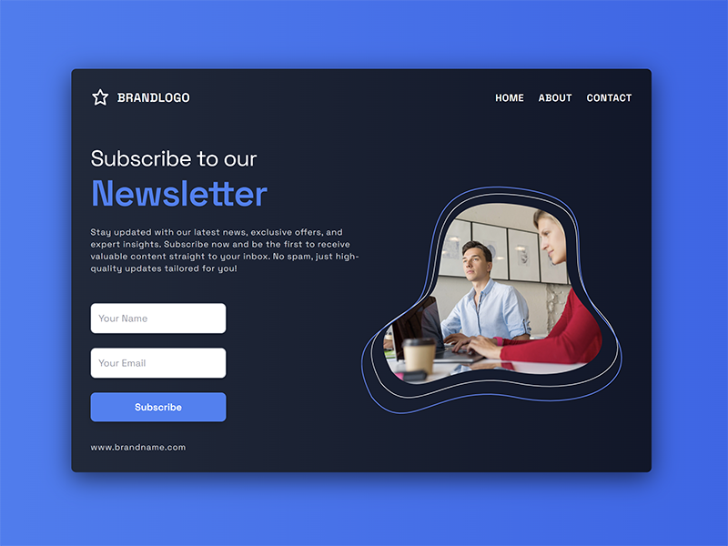
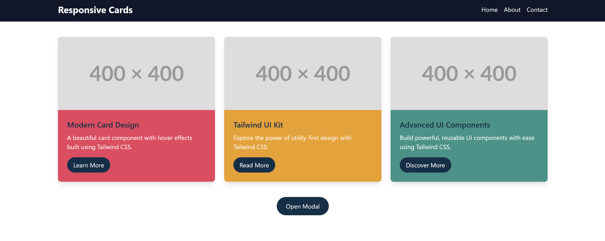
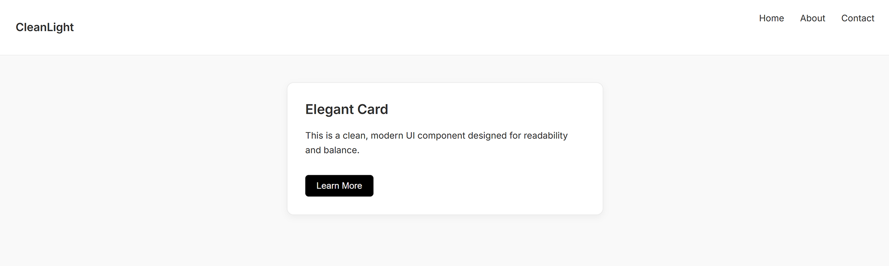
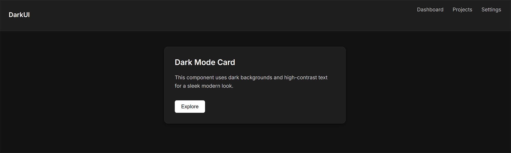
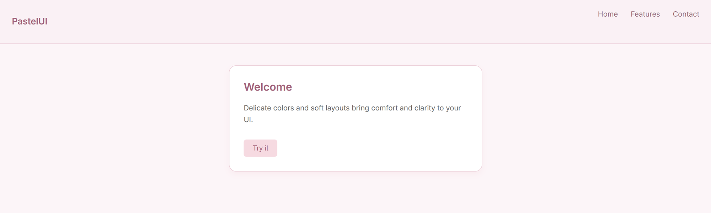
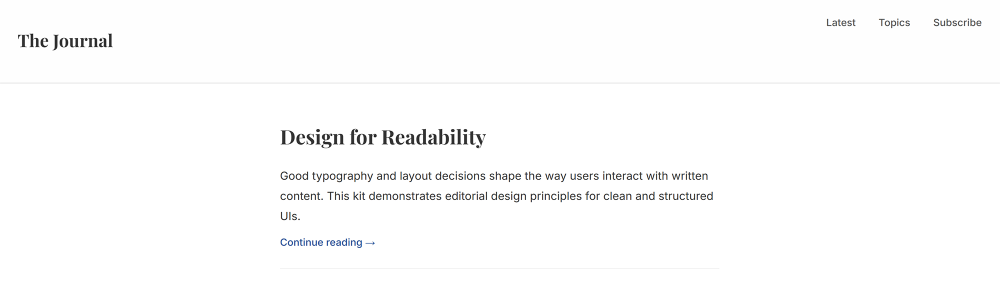

# 🎨 UI_Kits

A collection of minimalist and elegant UI component kits — built with clean HTML, CSS, Tailwind CSS and JavaScript.  
Each kit explores a different design theme and focuses on readability, layout, and usability.

---

## ✨ Kits Included

Each UI kit includes:

- Responsive layout and a few styled components
- Clear and purposeful design style
- Custom typography and spacing
- Screenshot preview

---

### 📰 Responsive Landiing page with Tailwind CSS

A simple, modern, and responsive landing page template designed using HTML, CSS, and Tailwind CSS. Featuring a dynamic, irregularly cropped image created with an SVG mask, along with a subscription form, to provide a distinctive and engaging user experience. This template can be easily customized for various use cases such as newsletters, marketing pages, or promotional content.

## 📷 Preview

📁 [`/landing_page`](./landing_page)

---

### 🖌️ Responsive Cards with Tailwind CSS

This is a simple, responsive webpage that features a navigation bar, a set of responsive cards, and a modal. The project is built using Tailwind CSS and JavaScript. The layout adjusts seamlessly for mobile, tablet, and desktop views.

## 📷 Preview

📁 [`/ui-tailwind`](./ui-tailwind)

---

### 🧼 Clean Light

A crisp, white-based theme with bold contrast and subtle UI elements. Great for modern dashboards and web apps.

  
📁 [`/clean-light`](./clean-light)

---

### 🖤 Modern Dark

A dark-themed interface with soft tones and strong typography — ideal for portfolios and developer tools.

  
📁 [`/modern-dark`](./modern-dark)

---

### 🌸 Soft Pastel

A warm, friendly palette using gentle pastel colors and rounded layouts. Ideal for lifestyle or creative projects.

  
📁 [`/soft-pastel`](./soft-pastel)

---

### 📰 Editorial

A content-first design inspired by editorial layouts. Features serif typography, a strong vertical rhythm, and clear reading flow.

  
📁 [`/editorial`](./editorial)

---

## 🚀 Usage

Each folder is standalone. Open any `index.html` in your browser to preview the kit.

🧠 Purpose

UI_Kits is a personal project designed to:

Practice clean UI/UX design systems

Share reusable front-end components

Showcase visual styles for interfaces

Feel free to fork, remix, or use elements with credit.

📄 License

MIT License — open for use with credit.  
See the full [LICENSE](./LICENSE) for more details.

Fonts are provided by [Google Fonts](https://fonts.google.com/).
