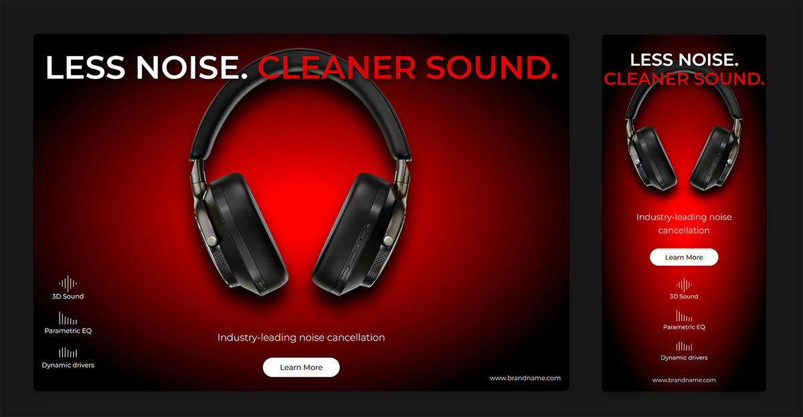

## 🎧 Responsible Web Banner

A sleek, responsive promotional banner built with HTML and TailwindCSS, designed to showcase high-end headphones with a bold visual aesthetic and modern UI components — perfect for showcasing premium audio products. Includes custom-designed icons and a bold call to action.

## ✨ Features

- 🎨 Custom Icons: Designed to represent key audio features:
- sound.svg – 3D Sound
- equalizer.svg – Parametric EQ
- dynamic.svg – Dynamic Drivers
- 🧠 Bold Messaging: Eye-catching header with radial gradient and shadowed typography.
- 📱 Responsive Layout: Mobile-first design with adaptive positioning and scaling.
- 🎧 Product Showcase: Central headphone image with supporting feature highlights.
- 🖱️ Call to Action: Interactive “Discover Pure Audio” button with hover effects.
- 🌐 Brand Footer: Subtle branding placed responsively at the bottom.

## 📷 Preview



---

## 🛠️ Technologies Used

- HTML5
- TailwindCSS (via CDN)
- Google Fonts – Montserrat
- SVG Icons – Custom-designed for the project

📂 File Structure
├── index.html
├── headphones.webp
├── sound.svg
├── equalizer.svg
├── dynamic.svg

## 🚀 Getting Started

1. Clone the repository:

```bash
git clone https://github.com/your-username/web-banner.git

```

2. Navigate to the project directory:

```bash
  cd web-banner

```

3. Open index.html in your browser:

```bash
open index.html  # On macOS
start index.html  # On Windows
xdg-open index.html  # On Linux

```

No additional installation is required as this template relies on external links for Tailwind CSS and Google Fonts.

## 🎨 Customization

- Replace headphones.webp with your own product image.
- Update the header text and button link to match your brand.
- Swap out icons or add new ones to highlight different features.

## Dependencies

- [Tailwind CSS](https://tailwindcss.com/) - Used for styling the page.
- [Google Fonts](https://fonts.google.com/) - For custom fonts (Montserrat).

Feel free to modify it according to your project needs!
